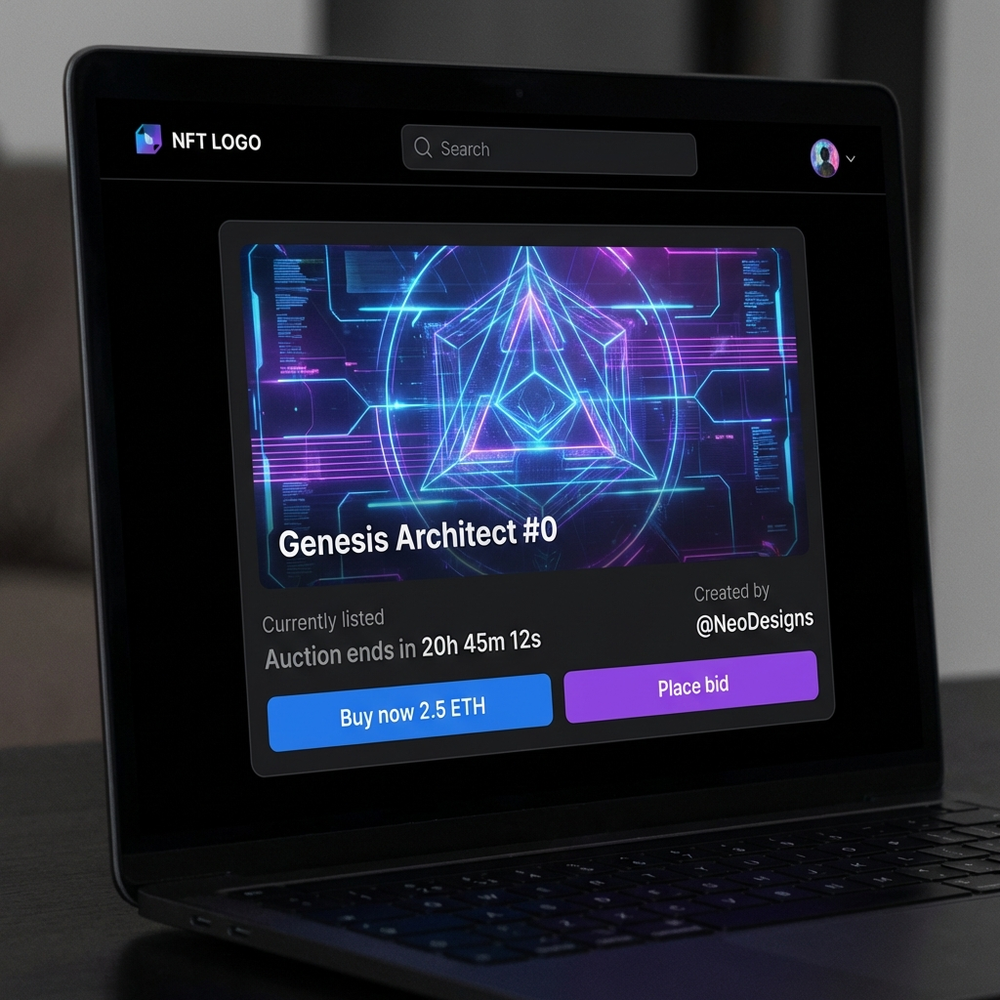
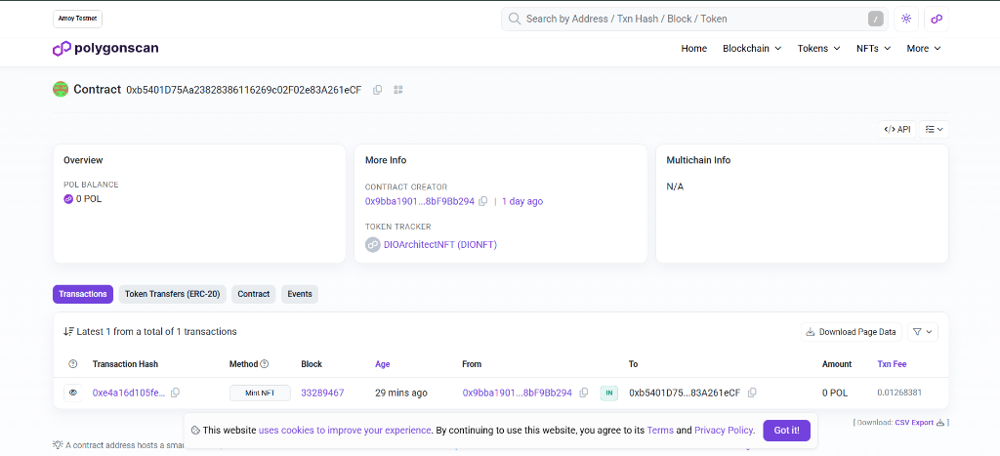

# 🎨 DIO NFT Key

Este projeto é parte do desafio da Digital Innovation One (DIO) para criar e mintar um NFT.
Neste repositório, exploramos a criação de um NFT utilizando a rede **Polygon** (via Amoy Testnet para desenvolvimento gratuito e profissional).

## 🖼️ Visual Showcase
Para evidenciar o sucesso da criação e transferência, incluímos os assets e mockups do projeto:

| Genesis Architect #0 | Showcase no Marketplace | Prova On-chain (PolygonScan) |
|:---:|:---:|:---:|
|  |  |  |

## 🚀 Sobre o Projeto
O objetivo é desmistificar a criação de NFTs, indo além do "upload de imagem" e entendendo a infraestrutura por trás (Smart Contracts).

## 🛠️ Tecnologias
- **Solidity**: Linguagem do Smart Contract.
- **Hardhat**: Framework de desenvolvimento Ethereum.
- **Polygon Amoy**: Rede de testes (Gas grátis).
- **OpenSea**: Marketplace de visualização.
- **IPFS**: Armazenamento descentralizado da arte (opcional/simulado).

## 📋 Pré-requisitos
- Node.js instalado.
- Metamask configurada na rede Polygon Amoy.
- Tokens MATIC de teste (Faucets disponíveis).

## 📦 Como rodar
1. Clone o repo.
2. `npm install`
3. Configure o `.env` com sua Private Key e API Key da PolygonScan.
4. `npx hardhat run scripts/deploy.js --network amoy`

## ✅ Status do Projeto
- **Smart Contract Address (Amoy)**: `0xb5401D75Aa23828386116269c02F02e83A261eCF`
- **Deploy**: Sucesso ✅
- **Mint**: Sucesso ✅ (Token #0 enviado para a carteira do instrutor)
- **Verificação On-chain**: Sucesso ✅ (Saldo da carteira `0xA9...c096` = 1 NFT)

## 🧪 Como Testar
Este projeto contém testes automatizados para garantir a segurança do contrato.
Execute:
\```bash
npx hardhat test
\```
Esperado: 4 testes passando (Deploy, Owner check, Mint logic).

## 🔗 Links Úteis
- [Fauce Polygon Amoy](https://faucet.polygon.technology/)
- [OpenSea Testnet](https://testnets.opensea.io/)
